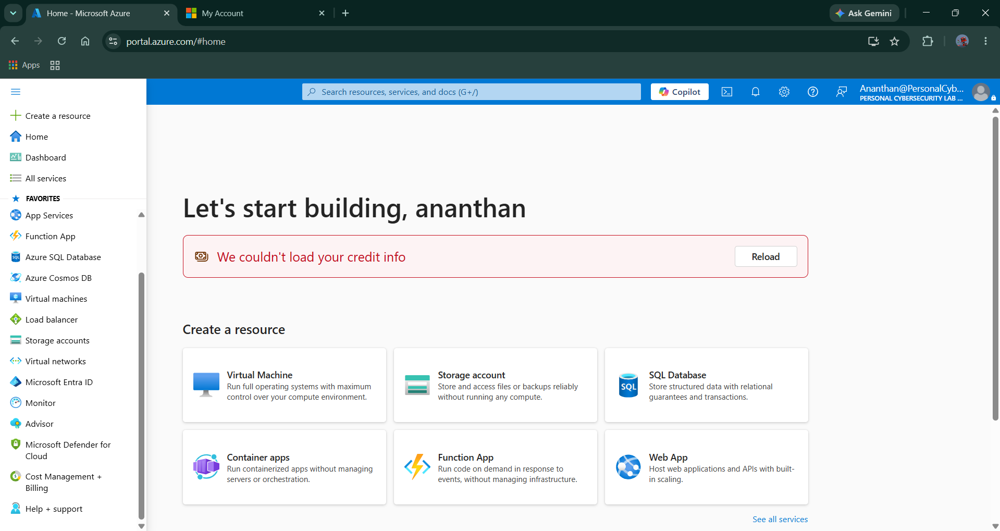
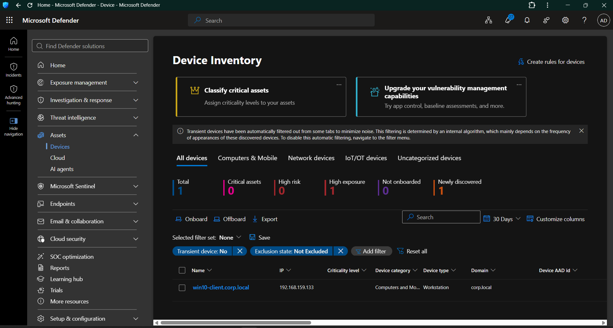
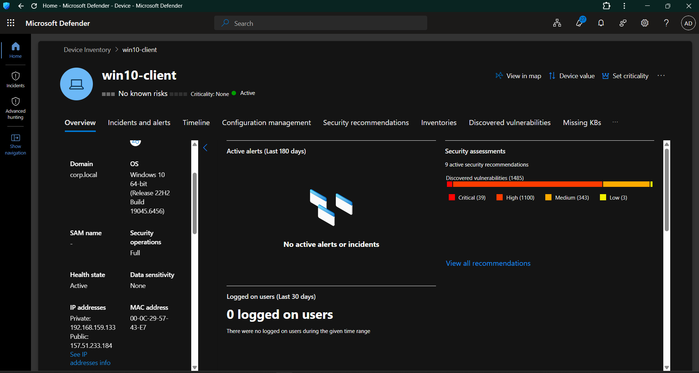
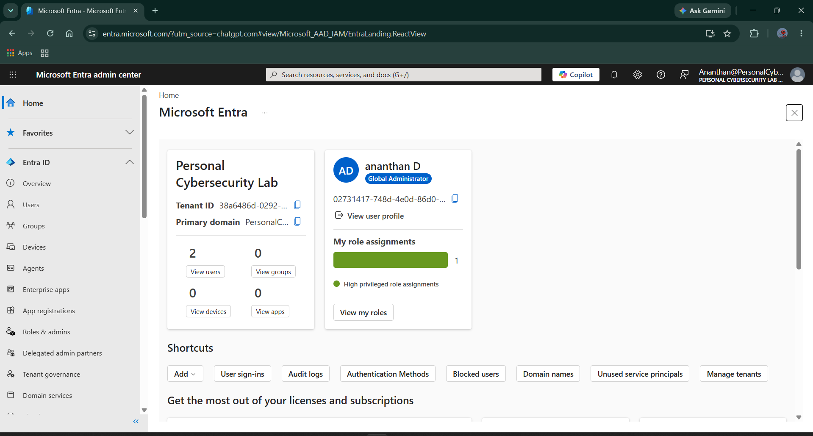
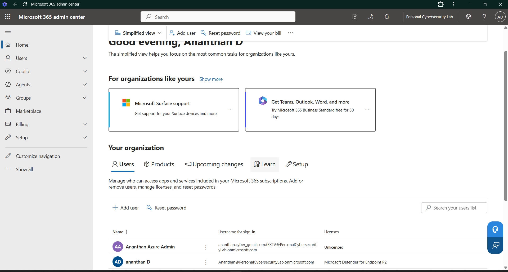
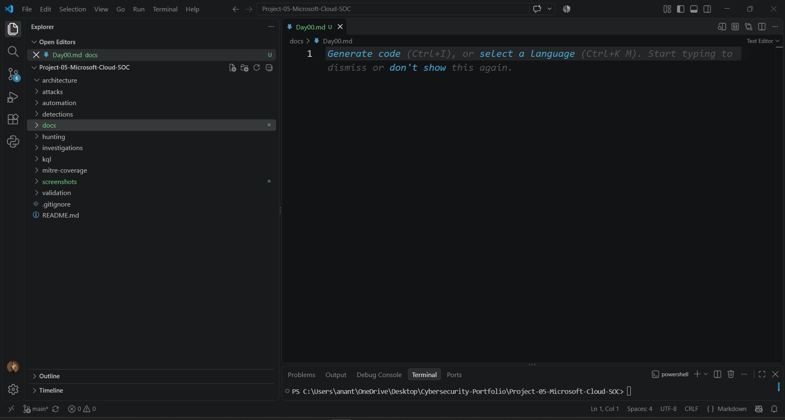

# Day 00 — Microsoft Cloud SOC Environment Preparation

**Project:** Project 05 — Microsoft Cloud SOC, EDR & Threat Hunting Lab  
**Phase:** Environment Preparation  
**Day:** 00  
**Status:** Completed  
**Primary Focus:** Azure, Microsoft Defender for Endpoint, Microsoft Entra ID, Microsoft 365, Windows endpoint onboarding, documentation and Git/GitHub setup

---

## 1. Objective

Day 0 established the foundational environment required for the Microsoft Cloud SOC lab.

The objectives were to:

- Prepare and verify the Microsoft cloud environment
- Align the Azure subscription with the Microsoft security tenant
- Prepare Microsoft Defender for Endpoint
- Onboard the Windows 10 lab endpoint
- Verify Microsoft Entra ID
- Verify the Microsoft 365 administrative environment
- Establish the local documentation workflow
- Establish Git version control
- Create and connect the GitHub repository
- Establish the evidence collection and screenshot structure

The purpose of Day 0 was environment readiness. Detection engineering, threat hunting, incident investigation, and response activities will be performed during later project days.

---

## 2. Lab Environment

### Cloud Environment

| Component | Purpose | Status |
|---|---|---|
| Microsoft Azure | Cloud infrastructure and Sentinel platform | Ready |
| Azure Subscription | Cloud resource management | Active |
| Microsoft Defender for Endpoint P2 | Endpoint Detection and Response | Active |
| Microsoft Entra ID | Identity and authentication | Ready |
| Microsoft 365 Admin Center | Tenant administration | Available |
| Microsoft Defender Portal | Security operations and endpoint visibility | Ready |

### Local Lab Environment

| Component | Purpose | Status |
|---|---|---|
| Windows 10 VM | Primary monitored endpoint | Onboarded |
| Windows Server 2022 AD DC | Active Directory infrastructure | Available |
| Ubuntu VM | Supporting security system | Available |
| Kali Linux VM | Controlled attacker simulation | Available |
| VMware Workstation | Virtualization platform | Operational |
| Visual Studio Code | Documentation and project development | Configured |
| Git | Version control | Initialized |
| GitHub | Public project repository | Configured |

---

## 3. Azure Environment Preparation

The Azure environment was prepared as the cloud foundation for the project.

The Azure subscription was aligned with the **Personal Cybersecurity Lab** Microsoft Entra tenant so that the Azure and Microsoft security environments operate within the intended lab tenant.

### Environment State

- Azure subscription is active.
- Azure subscription directory transfer was completed.
- The subscription was transferred from the previous directory to **Personal Cybersecurity Lab**.
- The lab administrative account retained Owner access to the subscription.
- Current Azure cost was verified at **$0.00** during the setup stage.
- No unnecessary Azure resources were created during Day 0.

This tenant alignment was an important prerequisite before continuing with Microsoft Sentinel and other Azure security services.

### Evidence

**Evidence:** `Day00-01-Azure-Home.png`

---

## 4. Microsoft Defender for Endpoint Preparation

Microsoft Defender for Endpoint P2 was enabled for the lab environment.

The Microsoft Defender portal was verified and the device inventory was checked during the endpoint onboarding process.

The Windows 10 laboratory endpoint was successfully discovered and onboarded.

### Endpoint

| Attribute | Value |
|---|---|
| Hostname | `win10-client` |
| Domain | `corp.local` |
| Operating System | Windows 10 22H2 |
| Device Type | Workstation |
| Security Operations | Full |
| Health State | Active |
| Onboarding Status | Onboarded |

The endpoint subsequently appeared in the Microsoft Defender device inventory.

### Evidence — Defender Device Inventory

**Evidence:** `Day00-02-Defender-Device-Inventory.png`

### Evidence — Defender Device Overview

**Evidence:** `Day00-03-MDE-Device-Overview.png`

---

## 5. Windows Endpoint Onboarding

The existing Windows 10 VMware endpoint was selected as the primary endpoint for Microsoft Defender for Endpoint telemetry.

The Defender local onboarding package was downloaded and transferred to the Windows 10 virtual machine using the VMware shared-folder mechanism.

The onboarding process was executed locally on the endpoint.

### Initial Onboarding Issue

The endpoint did not immediately appear in the Microsoft Defender device inventory after the onboarding script was initially executed.

Troubleshooting was performed to determine whether the endpoint had successfully completed onboarding and whether the machine had connectivity to the Microsoft Defender service.

The Windows 10 VM was also dependent on the Active Directory Domain Controller VM for its network/internet connectivity.

After the required lab connectivity was available, the endpoint appeared in Microsoft Defender.

### Final Onboarding Result

The endpoint reached the following state:

- Device discovered
- Device visible in Defender inventory
- Device active
- Device onboarded
- Security operations set to Full
- Defender engine reporting
- Sense client reporting

This establishes the Windows endpoint as the primary endpoint telemetry source for later detection engineering and threat-hunting activities.

---

## 6. Microsoft Entra ID Environment

The Microsoft Entra tenant was verified as the identity layer for the lab.

### Tenant

**Tenant:** `Personal Cybersecurity Lab`

The lab administrative account was verified with the required administrative access.

Microsoft Entra ID will provide the identity and authentication layer for later activities including:

- Authentication investigation
- Failed sign-in analysis
- Successful authentication following failed attempts
- Password-spray detection
- Brute-force detection
- Identity threat hunting
- Identity-to-endpoint correlation

### Evidence

**Evidence:** `Day00-04-Entra-Tenant-Overview.png`

---

## 7. Microsoft 365 Administrative Environment

The Microsoft 365 Admin Center was verified for the lab tenant.

The administrative environment provides the management layer for the Microsoft 365 tenant and its users.

The tenant contains the lab administrative identity and the guest/admin identity used during the Azure tenant alignment process.

The Microsoft 365 environment will only be used where required by the project's Microsoft security workflow.

### Evidence

**Evidence:** `Day00-05-M365-Admin-Center-Overview.png`

---

## 8. Documentation and Version Control Setup

A dedicated local workspace was created for Project 05.

### Local Project

`Project-05-Microsoft-Cloud-SOC`

### Documentation Workflow

The project uses:

- Visual Studio Code
- Markdown
- Git
- GitHub

The local repository was initialized using Git and connected to the GitHub repository.

### GitHub Repository

`ananthancyber/Project-05-Microsoft-Cloud-SOC`

The repository was created as a public cybersecurity portfolio project.

### Project Structure

    Project-05-Microsoft-Cloud-SOC/
    │
    ├── architecture/
    ├── attacks/
    ├── automation/
    ├── detections/
    ├── docs/
    ├── hunting/
    ├── investigations/
    ├── kql/
    │   ├── authentication/
    │   ├── correlation/
    │   ├── endpoint/
    │   └── hunting/
    ├── mitre-coverage/
    ├── screenshots/
    ├── validation/
    ├── .gitignore
    └── README.md

The structure separates:

- Architecture documentation
- Attack simulations
- Automation
- Detection engineering
- Daily documentation
- Threat hunting
- Investigations
- KQL queries
- MITRE ATT&CK mapping
- Screenshots and evidence
- Validation records

This structure is intended to make the project easier to review during technical interviews and demonstrate the complete SOC workflow rather than isolated tool usage.

### Evidence

**Evidence:** `Day00-06-VSCode-Project-Workspace.png`

---

## 9. Evidence Management

Day 0 evidence was organized under:

    screenshots/
    └── Day00/

### Day 0 Evidence Inventory

| Evidence ID | Screenshot | Purpose |
|---|---|---|
| DAY00-01 | `Day00-01-Azure-Home.png` | Azure environment |
| DAY00-02 | `Day00-02-Defender-Device-Inventory.png` | Defender device inventory |
| DAY00-03 | `Day00-03-MDE-Device-Overview.png` | Onboarded endpoint details |
| DAY00-04 | `Day00-04-Entra-Tenant-Overview.png` | Entra ID tenant |
| DAY00-05 | `Day00-05-M365-Admin-Center-Overview.png` | Microsoft 365 administration |
| DAY00-06 | `Day00-06-VSCode-Project-Workspace.png` | Local project and documentation environment |

All Day 0 screenshots were captured and stored in the project evidence directory.

---

## 10. Security and Privacy Controls

Because this repository is intended to be public, screenshots and documentation must be reviewed before being committed to GitHub.

The following information must never be committed:

- Passwords
- API keys
- Access tokens
- Client secrets
- HEC tokens
- Recovery codes
- MFA secrets
- Private certificates
- Sensitive authentication information

Tenant identifiers and other information should only be included where technically necessary and appropriate for a public portfolio.

Screenshots containing sensitive information should be cropped or redacted while retaining enough technical context to demonstrate the configuration.

---

## 11. Day 0 Validation

| Validation Item | Result |
|---|---|
| Azure subscription active | PASS |
| Azure tenant alignment completed | PASS |
| Microsoft Defender portal accessible | PASS |
| Defender for Endpoint P2 available | PASS |
| Windows 10 endpoint discovered | PASS |
| Windows 10 endpoint onboarded | PASS |
| Endpoint health state active | PASS |
| Defender device inventory verified | PASS |
| Entra ID tenant verified | PASS |
| Microsoft 365 Admin Center verified | PASS |
| VS Code project workspace created | PASS |
| Git repository initialized | PASS |
| GitHub repository created | PASS |
| Local repository connected to GitHub | PASS |
| Day 0 evidence captured | PASS |

---

## 12. Day 0 Validation Chain

The Day 0 environment-readiness validation can be represented as:

    Microsoft Cloud Tenant
            ↓
    Azure Subscription
            ↓
    Personal Cybersecurity Lab Tenant
            ↓
    Microsoft Defender for Endpoint
            ↓
    Windows 10 Lab Endpoint
            ↓
    Defender Device Inventory
            ↓
    Verified Onboarded Endpoint

The evidence captured during Day 0 supports the environment-readiness portion of this chain.

Detection and alert validation will be performed during later project days.

---

## 13. Day 0 Outcome

Day 0 successfully established the foundation for the Microsoft Cloud SOC laboratory.

The following components are now prepared:

- Microsoft Azure
- Azure subscription
- Personal Cybersecurity Lab tenant
- Microsoft Defender for Endpoint
- Windows 10 monitored endpoint
- Microsoft Entra ID
- Microsoft 365 administrative environment
- Visual Studio Code documentation workspace
- Git version control
- GitHub repository
- Evidence collection structure

The Windows 10 endpoint is successfully onboarded and visible in Microsoft Defender for Endpoint.

The project is therefore ready to move from environment preparation into SOC architecture and telemetry configuration.

---

## 14. SOC Architecture Direction

The intended project architecture is:

    Controlled Attack
            ↓
    Identity / Endpoint
            ↓
    Security Telemetry
            ↓
    Microsoft Defender
            ↓
    Microsoft Sentinel
            ↓
    KQL Detection
            ↓
    Alert / Incident
            ↓
    SOC Analyst Investigation
            ↓
    Response / Containment
            ↓
    Validation and Documentation

This architecture will be progressively implemented throughout the project.

---

## 15. Day 0 Completion Statement

**Status: COMPLETED**

Day 0 established and validated the foundational Microsoft Cloud SOC environment.

The Azure subscription and Microsoft security tenant were aligned, Microsoft Defender for Endpoint was prepared, the Windows 10 endpoint was successfully onboarded, the identity environment was verified, and the complete local Git/GitHub documentation workflow was established.

The project is ready to proceed to:

**Day 1 — SOC Architecture and Cloud Environment Configuration**