# Day 01 — Microsoft Cloud SOC Foundation & SIEM Deployment

**Project:** Project 05 — Microsoft Cloud SOC, EDR & Threat Hunting Lab  
**Day:** 01  
**Focus:** Azure SOC Infrastructure, Microsoft Sentinel, Log Analytics & Defender Endpoint Verification  
**Environment:** Personal Cybersecurity Lab  
**Region:** Central India  
**Status:** ✅ Completed

---

## 1. Day 01 Objective

The objective of Day 01 was to establish the core Microsoft cloud SOC infrastructure and verify that the endpoint security environment was operational.

The foundation established during this phase is:

**Windows 10 Endpoint → Microsoft Defender for Endpoint → Microsoft Sentinel / Log Analytics → SOC Analyst**

The environment was designed with a cost-controlled lab approach, using the existing Azure Free Account and Microsoft Sentinel trial while avoiding unnecessary telemetry sources and additional resources.

---

## 2. Environment Overview

| Component | Configuration / Status |
|---|---|
| Azure Tenant | Personal Cybersecurity Lab |
| Azure Subscription | Azure subscription 1 |
| Azure Subscription Status | Active |
| Resource Group | `rg-project05-soc` |
| Resource Group Region | Central India |
| Log Analytics Workspace | `law-project05-soc` |
| Log Analytics Region | Central India |
| Log Analytics Pricing | Pay-as-you-go |
| Microsoft Sentinel | Enabled |
| Sentinel Trial | 31-day trial |
| Microsoft Defender | Unified SecOps portal |
| Defender for Endpoint | Active |
| Windows Endpoint | `win10-client.corp.local` |
| Windows Version | Windows 10 Pro 22H2 |
| Endpoint Domain | `corp.local` |
| Endpoint IP | `192.168.159.133` |
| MDE Onboarding | Onboarded |
| Sentinel Data Connectors | Baseline checked |
| Endpoint Alerts | No active alerts/incidents at verification |
| SOC Architecture | Documented |

---

## 3. Azure Subscription Verification

The Azure subscription was verified before deploying the Project 05 infrastructure.

The subscription was confirmed as:

- **Subscription:** Azure subscription 1
- **Status:** Active
- **Role:** Owner
- **Directory:** Personal Cybersecurity Lab
- **Current cost at verification:** $0.00
- **Forecast:** $0.00

### Evidence

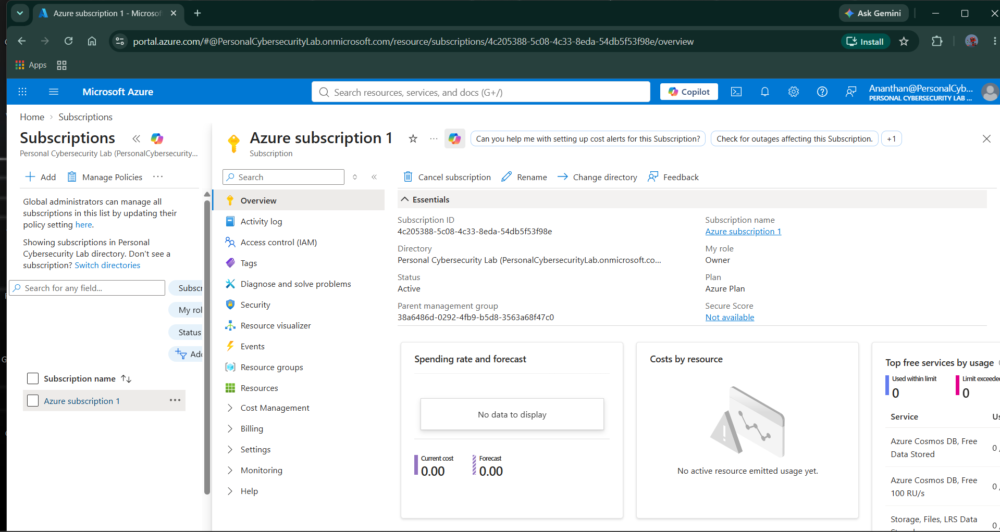

---

## 4. Resource Group Creation

A dedicated resource group was created to logically organize the Project 05 Azure resources.

**Resource group:**

`rg-project05-soc`

**Region:**

Central India

Using a dedicated resource group provides cleaner resource management, easier cost tracking, and a professional separation between this lab and other Azure resources.

### Baseline

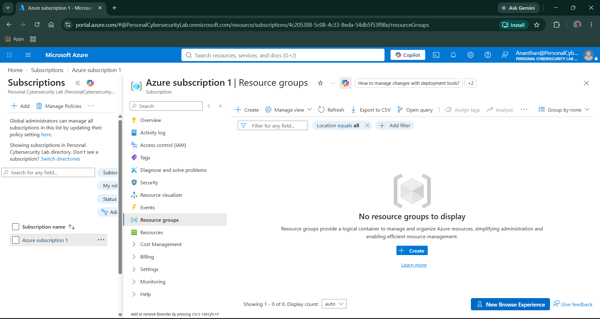

### Configuration

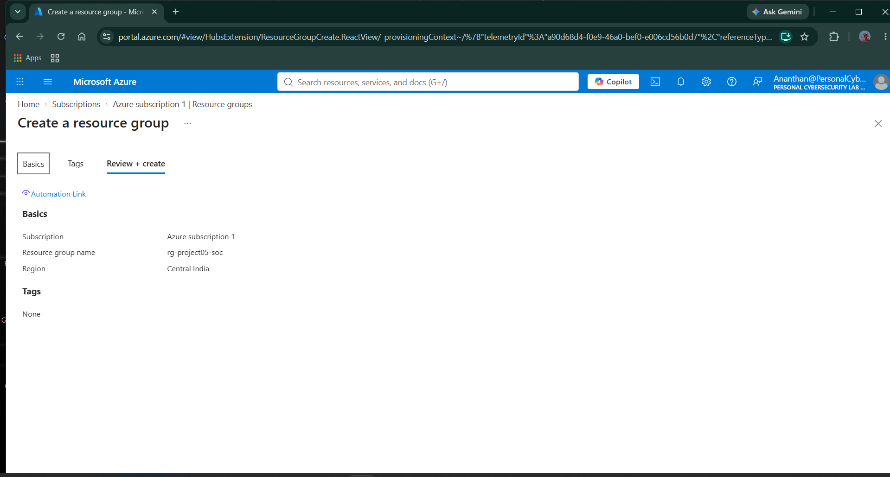

### Creation Result

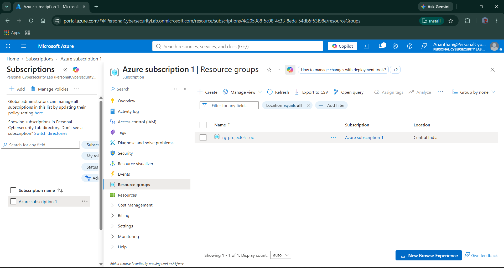

---

## 5. Log Analytics Workspace Deployment

A dedicated Log Analytics workspace was created as the primary log and telemetry repository for the Sentinel environment.

**Workspace:**

`law-project05-soc`

**Resource Group:**

`rg-project05-soc`

**Region:**

Central India

**Pricing Model:**

Pay-as-you-go

The workspace is intended to provide the underlying data platform used by Microsoft Sentinel for security telemetry, KQL querying, detection engineering, investigation, and threat hunting.

### Configuration

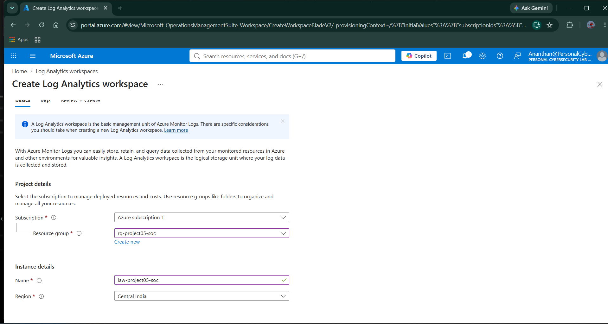

### Deployment

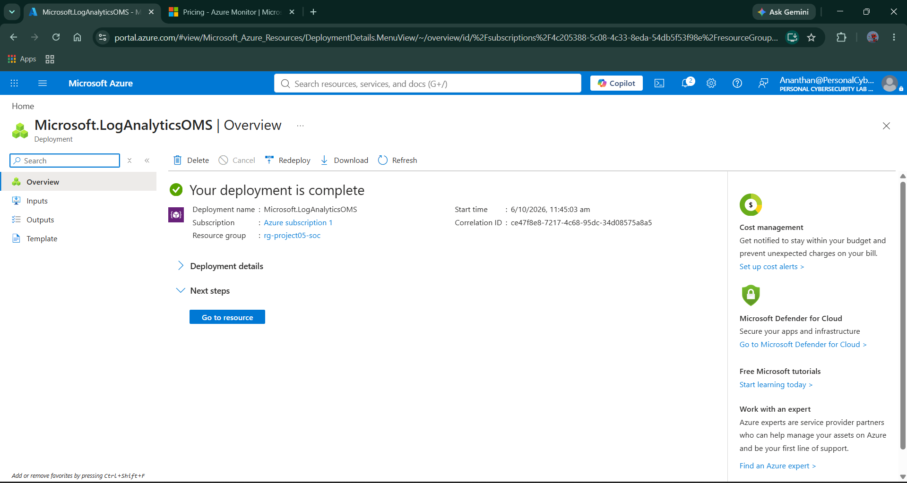

### Workspace Verification

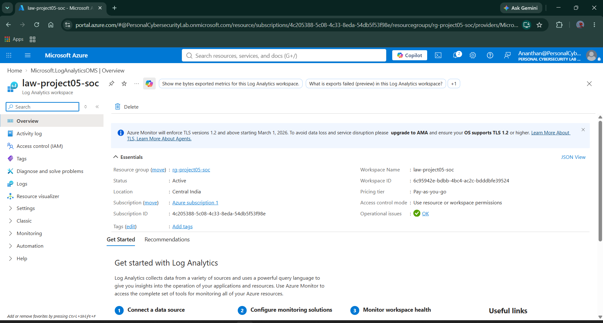

The workspace was verified as:

- **Status:** Active
- **Location:** Central India
- **Resource Group:** `rg-project05-soc`
- **Workspace:** `law-project05-soc`
- **Operational Issues:** OK

---

## 6. Microsoft Sentinel Deployment

Microsoft Sentinel was enabled on the existing Log Analytics workspace.

The workspace selected for Sentinel was:

`law-project05-soc`

This establishes the primary SIEM layer for Project 05.

### Sentinel Baseline

Before deployment, the Azure Sentinel resource inventory showed that no Sentinel workspace was configured.

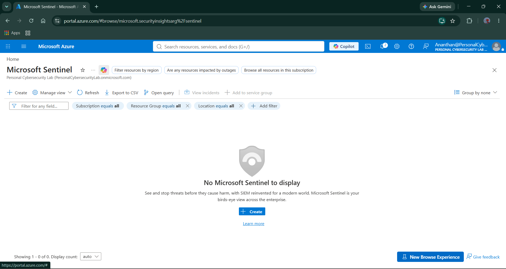

### Workspace Selection

The existing Log Analytics workspace was selected rather than creating an additional workspace.

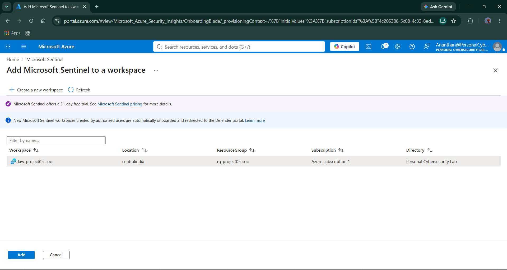

### Trial Activation

Microsoft Sentinel's 31-day free trial was successfully activated.

The trial confirmation showed the included daily data allowance for Sentinel and Log Analytics.

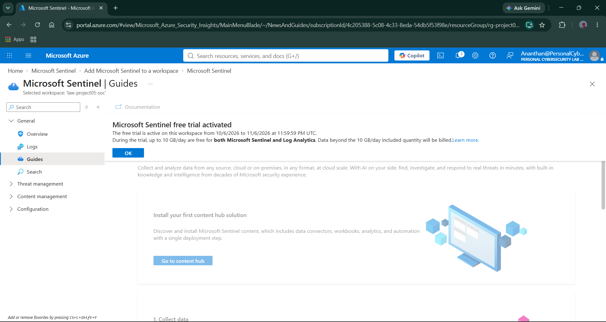

---

## 7. Microsoft Defender / Sentinel Unified SecOps Portal

Microsoft's current unified SecOps experience redirects Sentinel operations into the Microsoft Defender portal.

The Defender portal was verified and showed the Microsoft Sentinel integration, security monitoring capabilities, data connector access, incidents, and advanced hunting functionality.

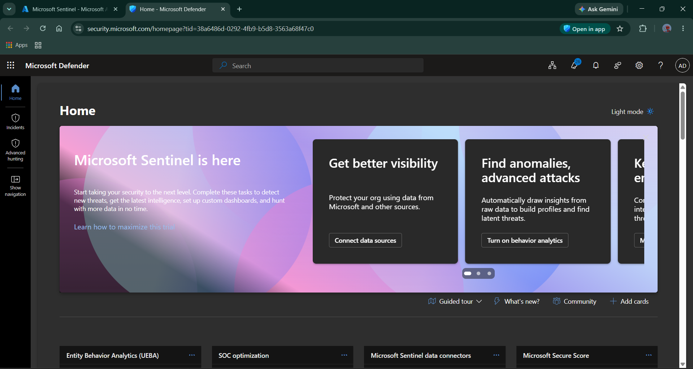

This establishes the operational interface that will be used throughout the project for:

- Security monitoring
- Incident investigation
- Threat hunting
- Detection analysis
- Endpoint investigation
- Response activities

---

## 8. Sentinel Data Connector Baseline

The Microsoft Sentinel data connector page was reviewed before enabling additional telemetry sources.

The baseline showed:

- **Connectors:** 1
- **Connected:** 1
- Microsoft provider data
- Existing connector state preserved

No unnecessary connectors were enabled during Day 01.

This was an intentional design decision to keep the lab controlled and prevent unnecessary telemetry ingestion and cost.

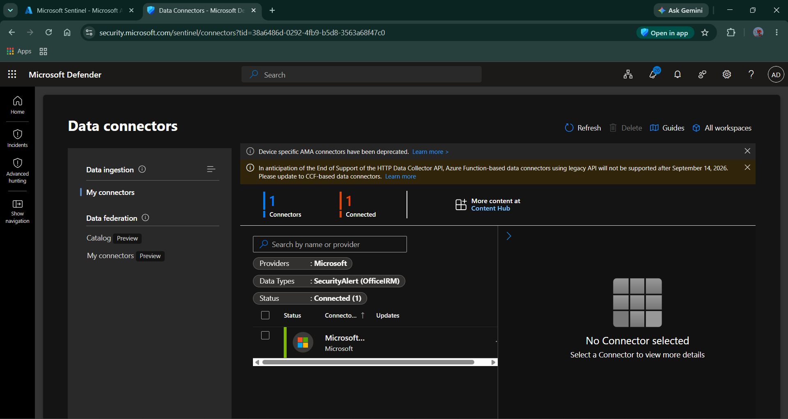

---

## 9. Microsoft Defender for Endpoint Verification

The Windows 10 endpoint used for the lab was verified in Microsoft Defender.

### Endpoint

`win10-client.corp.local`

### Configuration

- Windows 10 Pro
- Version 22H2
- 64-bit
- Domain: `corp.local`
- Private IP: `192.168.159.133`
- Device type: Workstation

The Defender Device Inventory confirmed that one endpoint was present and onboarded.

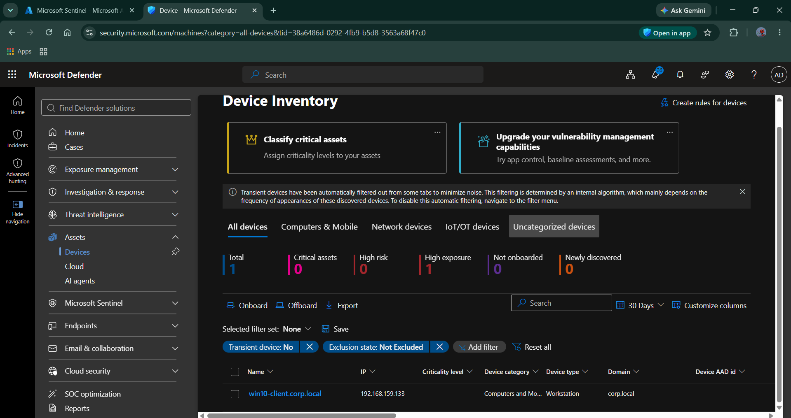

---

## 10. Defender Device Overview

The endpoint's Defender device page was reviewed to establish the initial security baseline.

The device showed:

- `win10-client`
- Windows 10 64-bit 22H2
- Domain `corp.local`
- No active alerts or incidents at the time of verification
- Defender security assessment data available

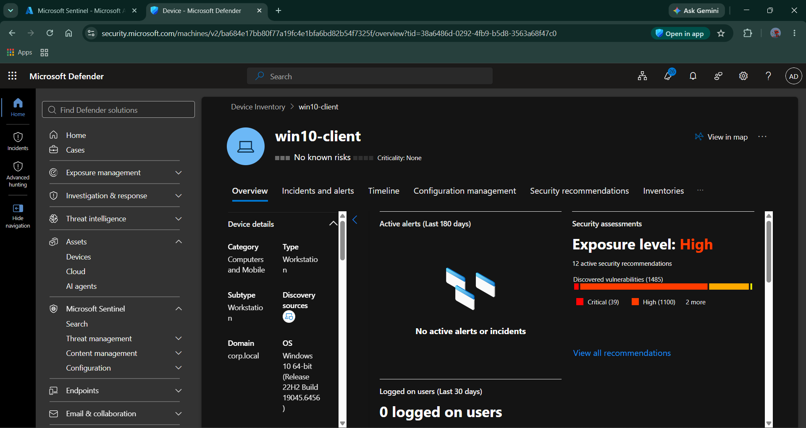

---

## 11. MDE Onboarding Verification

The most important endpoint verification was the explicit onboarding status.

The Defender device details confirmed:

**Onboarding status: Onboarded**

The endpoint was therefore successfully registered with Microsoft Defender for Endpoint and visible to the Defender security platform.

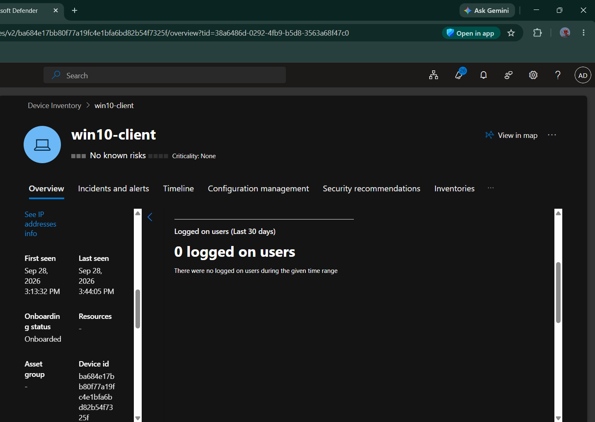

---

## 12. SOC Architecture

The Day 01 architecture establishes the following security telemetry path:

**Windows 10 Client**  
↓  
**Microsoft Defender for Endpoint**  
↓  
**Microsoft Defender / Unified SecOps**  
↓  
**Microsoft Sentinel**  
↓  
**Log Analytics Workspace**  
↓  
**SOC Analyst**  
↓  
**Detection → Investigation → Threat Hunting → Response**

The architecture diagram is stored in the project repository at:

`architecture/Project05-SOC-Architecture-Day01.png`

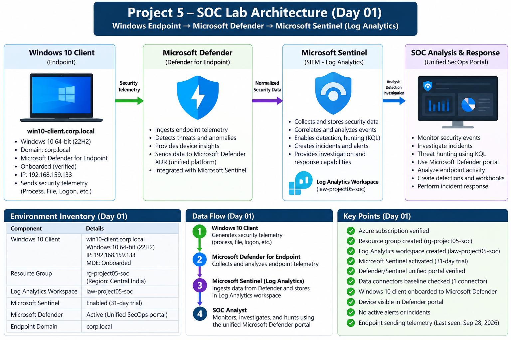

---

## 13. Day 01 Data Flow

### Endpoint Layer

The Windows 10 client acts as the controlled security endpoint and generates endpoint activity that can be investigated by the security platform.

### EDR Layer

Microsoft Defender for Endpoint provides endpoint visibility and security telemetry.

### SIEM Layer

Microsoft Sentinel provides the cloud SIEM capability, while the Log Analytics workspace provides the underlying telemetry repository and KQL query environment.

### SOC Layer

The Microsoft Defender unified SecOps portal provides the analyst-facing interface for monitoring, investigation, hunting, detection, and response.

---

## 14. Day 01 Validation

| Validation | Result |
|---|---|
| Azure subscription accessible | ✅ Passed |
| Subscription active | ✅ Passed |
| Resource group created | ✅ Passed |
| Resource group region verified | ✅ Passed |
| Log Analytics workspace created | ✅ Passed |
| Log Analytics workspace active | ✅ Passed |
| Sentinel workspace selected | ✅ Passed |
| Sentinel trial activated | ✅ Passed |
| Defender/Sentinel portal accessible | ✅ Passed |
| Sentinel connector baseline reviewed | ✅ Passed |
| Windows endpoint visible in Defender | ✅ Passed |
| MDE endpoint onboarded | ✅ Passed |
| Endpoint security baseline established | ✅ Passed |
| Architecture documented | ✅ Passed |
| Evidence captured | ✅ Passed |

---

## 15. Cost-Control Strategy

Because this is a personal cybersecurity lab, unnecessary Azure consumption was deliberately avoided.

The following controls were followed during Day 01:

- Used the existing Azure Free Account.
- Used the Microsoft Sentinel free trial.
- Used a single Log Analytics workspace.
- Used a single Windows endpoint.
- Avoided unnecessary Azure virtual machines.
- Did not enable UEBA during Day 01.
- Did not enable unnecessary Sentinel connectors.
- Kept the telemetry architecture intentionally minimal.
- Monitored the subscription cost before proceeding with additional services.

The objective is to maximize practical SOC experience while minimizing unnecessary cloud consumption.

---

## 16. Day 01 Outcome

Day 01 successfully established the **Microsoft Cloud SOC foundation**.

The environment now contains:

**Azure Subscription**  
→ **Dedicated Resource Group**  
→ **Log Analytics Workspace**  
→ **Microsoft Sentinel**  
→ **Microsoft Defender / Unified SecOps**  
→ **Onboarded Windows Endpoint**

The endpoint is visible in Microsoft Defender and has an explicit **Onboarded** status.

This provides the foundation required for the next stages of the project:

- Security telemetry ingestion
- KQL query development
- Authentication detections
- Endpoint detections
- Correlation
- Threat hunting
- Incident investigation
- Response automation

---

## 17. Day 01 Deliverables

### Infrastructure

- [x] Azure subscription verified
- [x] Resource group created
- [x] Log Analytics workspace deployed
- [x] Microsoft Sentinel activated
- [x] Defender/Sentinel unified portal verified

### Endpoint

- [x] Windows 10 endpoint prepared
- [x] Microsoft Defender for Endpoint onboarding completed
- [x] Device visible in Defender
- [x] Onboarding status verified

### Documentation

- [x] Environment inventory
- [x] SOC architecture
- [x] Data flow
- [x] Validation results
- [x] Evidence screenshots
- [x] Cost-control approach

---

## 18. Day 02 Preparation

Day 01 establishes the infrastructure foundation.

The next phase will focus on **identity and telemetry**, including:

- Entra ID security telemetry
- Authentication/sign-in activity
- Audit activity
- Defender telemetry availability
- Sentinel ingestion validation
- Identifying the exact tables available for KQL

The project will continue using the principle:

**Telemetry → Query → Detection → Alert → Investigation → Conclusion**

---

## Day 01 Status

**🟢 COMPLETE**

