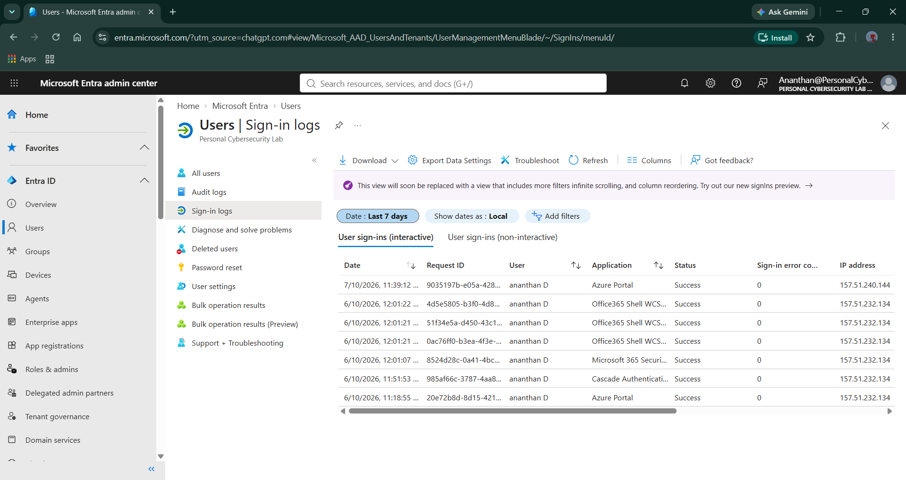
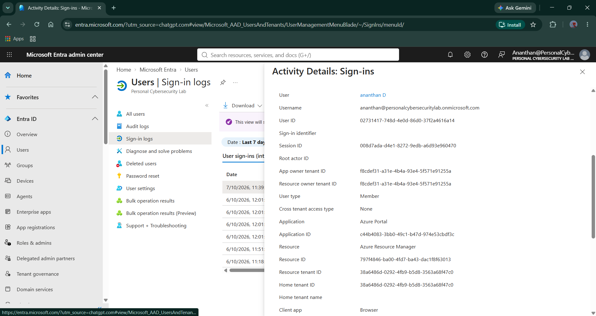
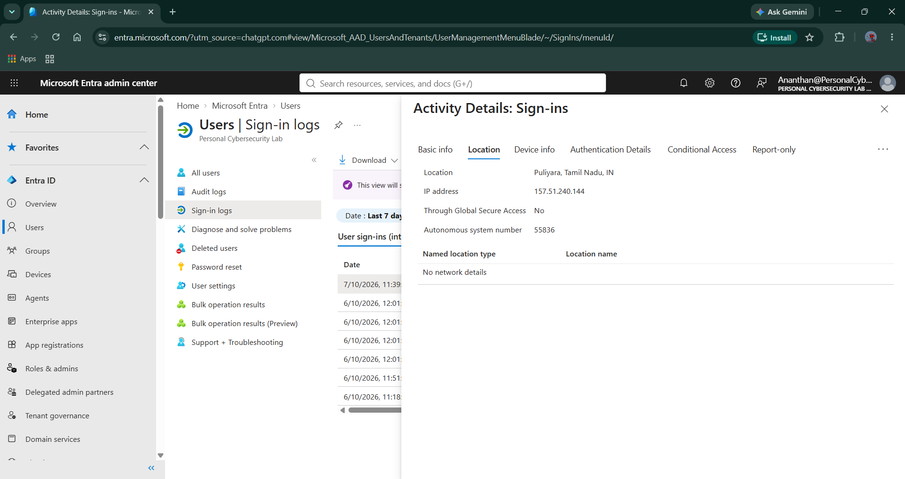
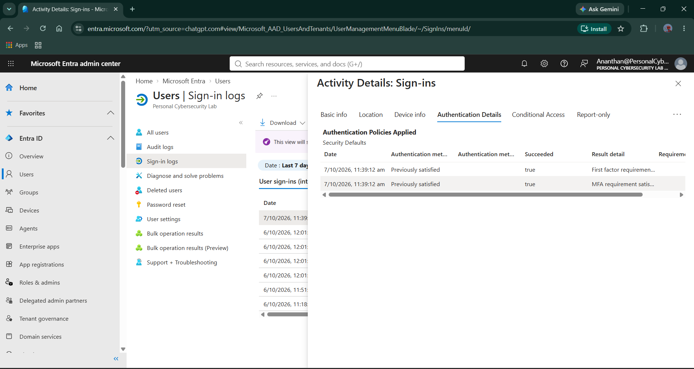
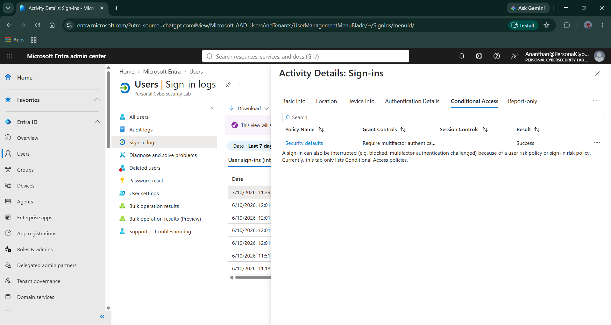
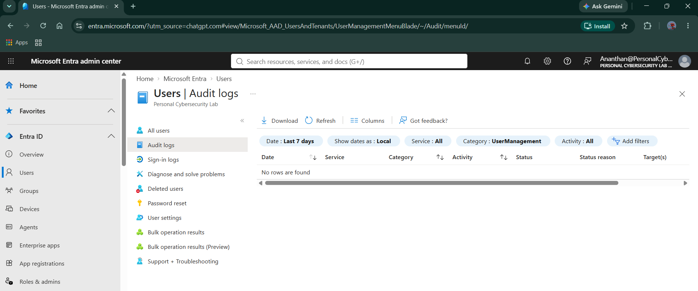

# Day 02 — Entra ID & Identity Telemetry

**Project:** Microsoft Cloud SOC, EDR & Threat Hunting Lab  
**Day:** 02  
**Focus:** Microsoft Entra ID — Identity & Authentication Telemetry  
**Environment:** Personal Cybersecurity Lab  
**Primary Platform:** Microsoft Entra ID

---

## 1. Objective

The objective of Day 02 was to establish an identity-telemetry baseline in Microsoft Entra ID and understand how a SOC analyst investigates authentication activity.

The investigation focused on:

- User sign-in activity
- Sign-in event details
- Source IP and geographic context
- Authentication and MFA details
- Conditional Access results
- Entra ID audit logs
- User → Sign-in → IP → Device → Application → Outcome investigation flow

This establishes the identity telemetry foundation required for later authentication detections, threat hunting, correlation, and incident investigation.

---

## 2. Environment

| Component | Configuration |
|---|---|
| Tenant | Personal Cybersecurity Lab |
| Identity Platform | Microsoft Entra ID |
| Primary Lab Identity | ananthan D |
| Authentication | Microsoft Entra authentication |
| MFA | Enabled / observed in authentication details |
| Conditional Access | Security Defaults |
| Sign-in Log Type | Interactive user sign-ins |
| Audit Log Scope | User Management |
| Investigation Window | Last 7 days |

---

## 3. Identity Telemetry Baseline

The Entra ID Users section was reviewed to establish the available identities in the lab tenant.

The tenant contained:

- `Ananthan Azure Admin` — Guest
- `ananthan D` — Member

The member identity was used to review the available sign-in telemetry and authentication context.

> **Documentation note:** A separate dedicated attack/test identity is not claimed here because the captured evidence does not establish one. Controlled test identities can be introduced later when authentication attack scenarios are created.

---

## 4. Interactive Sign-in Log Baseline

The Microsoft Entra **Sign-in logs** page was reviewed using the interactive user sign-in view.

The baseline demonstrated successful authentication events containing information such as:

- Date/time
- Request ID
- User
- Application
- Sign-in status
- Sign-in error code
- Source IP address

The observed events provided the initial identity telemetry required for later SOC investigations.

### Evidence



**Evidence file:** `Day02-01-Entra-Sign-In-Logs-Baseline.png`

---

## 5. Sign-in Event Investigation

An individual sign-in event was opened to examine the details available to an analyst.

The event provided identity and authentication context including:

- User
- Username
- User ID
- Session information
- Application
- Application ID
- Resource
- Resource tenant
- Home tenant
- Client application

This demonstrates the first investigation pivot:

**User → Sign-in Event → Application → Resource**

### Evidence



**Evidence file:** `Day02-02-Entra-Sign-In-Event-Details.png`

---

## 6. Geographic and IP Investigation

The sign-in event's **Location** information was reviewed.

The event provided:

- Approximate geographic location
- Source IP address
- Autonomous System Number
- Global Secure Access status
- Named location information

This provides an analyst with geographic and network context when determining whether a sign-in is expected or suspicious.

### Analyst Pivot

**User → Sign-in → Source IP → Geographic Location**

> Geographic information should be treated as contextual evidence rather than proof of compromise because IP geolocation can be approximate.

### Evidence



**Evidence file:** `Day02-03-Entra-Sign-In-Location-Details.png`

---

## 7. Authentication & MFA Investigation

The **Authentication Details** section of the sign-in event was reviewed.

The captured event showed authentication policy information including:

- Security Defaults
- Previously satisfied authentication state
- Successful authentication
- MFA requirement satisfied

This establishes that authentication events can provide additional context beyond simply showing a successful or failed login.

### Analyst Pivot

**Sign-in → Authentication Method → MFA Requirement → Authentication Outcome**

### Evidence



**Evidence file:** `Day02-04-Entra-Authentication-Details.png`

---

## 8. Conditional Access Investigation

The **Conditional Access** section of the sign-in event was reviewed.

The captured event showed:

- Policy: `Security defaults`
- Grant control: MFA requirement
- Result: `Success`

This demonstrates how an analyst can determine which access-control policy was applied to a sign-in and whether the required control was successfully satisfied.

### Analyst Pivot

**Sign-in → Conditional Access Policy → Grant Control → Result**

### Evidence



**Evidence file:** `Day02-05-Entra-Conditional-Access-Result.png`

---

## 9. Audit Log Review

Microsoft Entra **Audit logs** were reviewed to establish the administrative activity baseline.

The review was performed for:

- Time range: Last 7 days
- Service: All
- Category: User Management
- Activity: All

The captured view did not return rows for the selected User Management filter during the review.

This result was documented rather than interpreted as a failure. An empty audit-log result can simply mean that no matching User Management activity occurred within the selected period/filter.

### Evidence



**Evidence file:** `Day02-06-Entra-Audit-Logs-Baseline.png`

---

## 10. Identity Investigation Workflow Established

Day 02 established the following investigation workflow:

```text
User
  ↓
Sign-in Event
  ↓
Source IP
  ↓
Geographic Context
  ↓
Device Context
  ↓
Application / Resource
  ↓
Authentication & MFA
  ↓
Conditional Access
  ↓
Authentication Outcome
```

This workflow will be reused during future authentication detections and incident investigations.

---

## 11. Day 02 Evidence Summary

| Evidence | Purpose | Status |
|---|---|---|
| Day02-01 | Interactive sign-in baseline | ✅ Captured |
| Day02-02 | Individual sign-in event details | ✅ Captured |
| Day02-03 | Source IP and location context | ✅ Captured |
| Day02-04 | Authentication and MFA context | ✅ Captured |
| Day02-05 | Conditional Access result | ✅ Captured |
| Day02-06 | Audit log baseline | ✅ Captured |

---

## 12. Day 02 Outcome

Day 02 established a working identity-telemetry investigation baseline in Microsoft Entra ID.

The lab now provides visibility into:

- Interactive user authentication
- Sign-in event context
- Source IP information
- Geographic context
- Authentication and MFA state
- Conditional Access decisions
- Audit-log availability

The collected evidence demonstrates the basic workflow a SOC analyst can use to move from an identity event toward broader investigation context.

---

## 13. Security Operations Relevance

From a SOC analyst perspective, a successful login should not automatically be treated as benign.

During future investigations, the following questions will be important:

1. **Who authenticated?**
2. **When did the authentication occur?**
3. **What source IP was used?**
4. **Where did the authentication originate?**
5. **Which application or resource was accessed?**
6. **What authentication method was used?**
7. **Was MFA satisfied?**
8. **Which Conditional Access controls were applied?**
9. **Was the behavior normal for the identity?**
10. **What endpoint activity occurred after authentication?**

These questions will become particularly important during the authentication detection and identity-to-endpoint correlation phases of the project.

---

## 14. Scope Decisions

The following items were intentionally not added to Day 02:

- Microsoft Entra ID Protection connector
- Non-interactive sign-in evidence
- Additional unnecessary identity connectors

These are not required to satisfy the Day 02 identity-telemetry scope established for this project.

The focus remains on obtaining and validating the core identity telemetry needed for later detection engineering and investigation.

---

## 15. Day 02 Completion Status

**Status: COMPLETED**

### Completed

- [x] Reviewed Entra ID users
- [x] Established interactive sign-in baseline
- [x] Investigated individual sign-in event
- [x] Reviewed source IP and geographic context
- [x] Reviewed authentication and MFA details
- [x] Reviewed Conditional Access result
- [x] Reviewed Entra audit logs
- [x] Captured evidence screenshots
- [x] Documented identity investigation workflow

