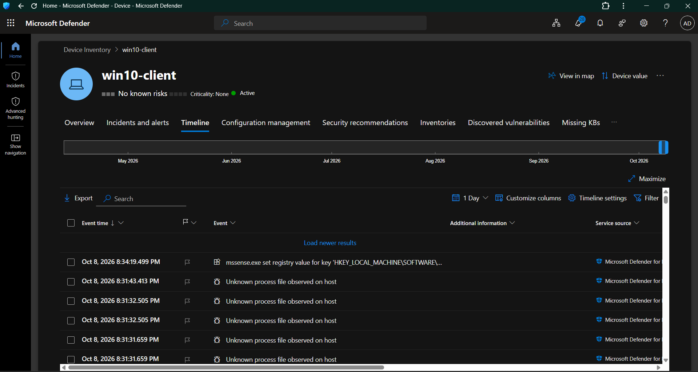
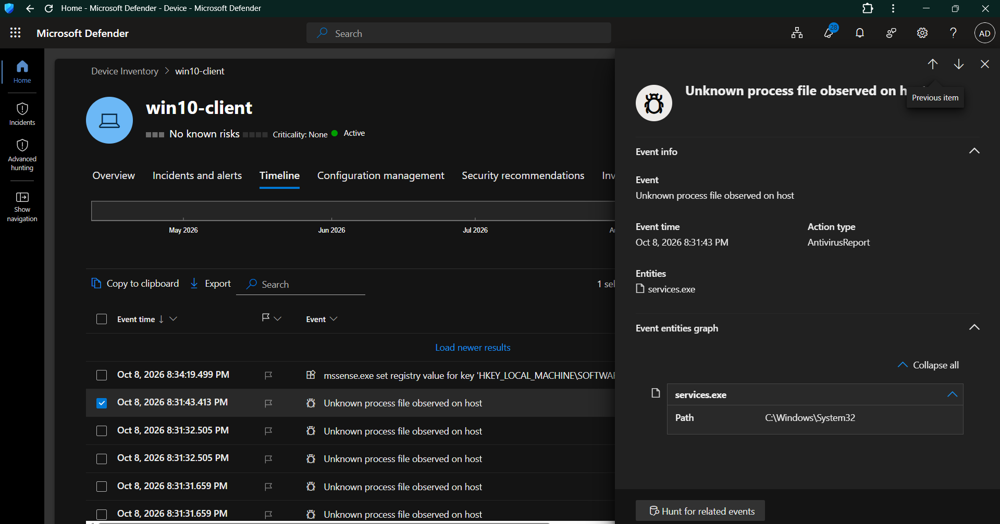
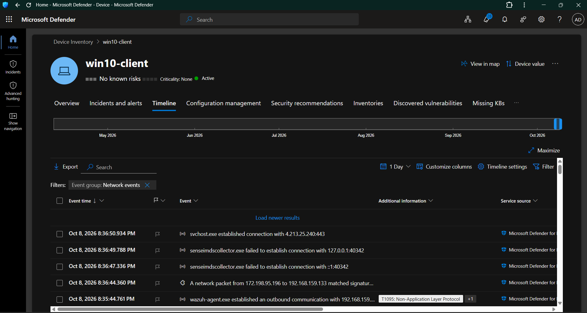
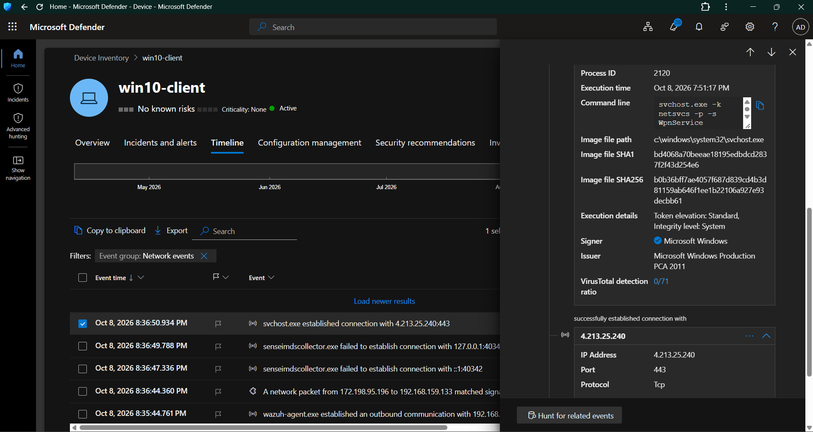
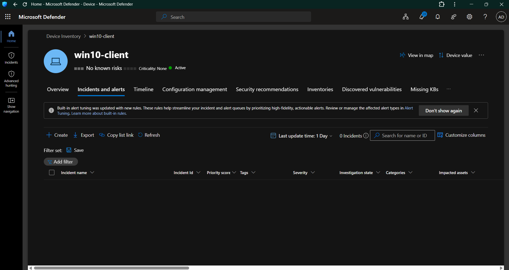
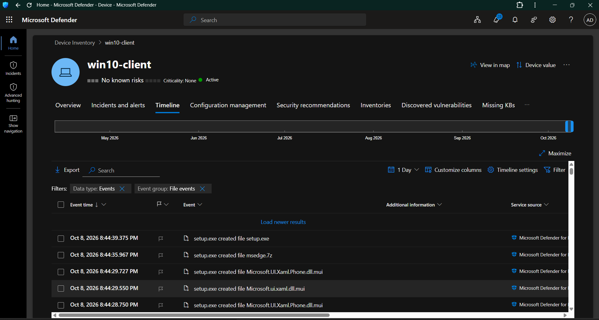
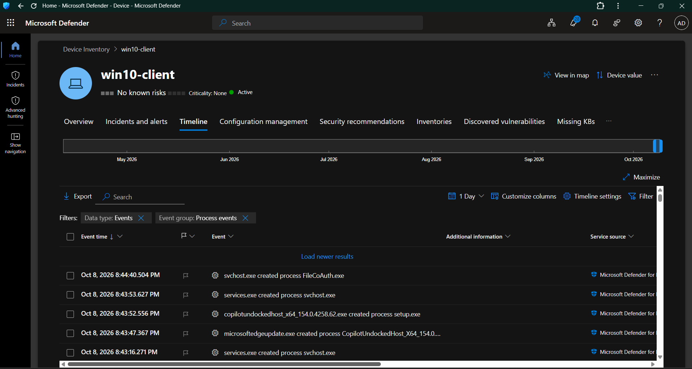

# Day 03 — Microsoft Defender for Endpoint Telemetry Verification

## 1. Objective

The objective of Day 03 was to verify Microsoft Defender for Endpoint (MDE) telemetry from the Windows endpoint before beginning detection engineering.

The focus was to confirm that the endpoint was actively reporting telemetry and that the Defender platform could provide useful security investigation data across:

- Device telemetry
- Timeline events
- Process telemetry
- File telemetry
- Network telemetry
- Alert and incident visibility

The purpose of this phase was telemetry validation rather than detection creation.

---

## 2. Environment

| Component | Configuration |
|---|---|
| Endpoint | WIN10-CLIENT |
| Device name in Defender | win10-client |
| Operating System | Windows 10 Pro 22H2 |
| OS Build | 19045.6456 |
| Domain | corp.local |
| Endpoint Security Platform | Microsoft Defender for Endpoint |
| Defender Sensor | Sense / MsSense.exe |
| Monitoring Platform | Microsoft Defender |
| Timeline Window | 1 Day |
| Telemetry Date | October 8, 2026 |

---

## 3. MDE Device Verification

The Windows endpoint was verified in the Microsoft Defender device inventory.

The device appeared as:

`win10-client`

The Defender device overview confirmed that the endpoint was active and available for security monitoring.

The endpoint also displayed:

- No known risks
- Criticality: None
- Health state: Active
- Active device status

The endpoint was therefore suitable for telemetry verification.

### Evidence

---

## 4. Defender Timeline Verification

The Microsoft Defender device Timeline was reviewed to determine whether endpoint telemetry was available.

Current timeline data was observed for October 8, 2026.

The timeline contained multiple events generated by Microsoft Defender for Endpoint, demonstrating that endpoint telemetry was actively being collected.

Observed event examples included:

- Process/file observations
- Registry activity
- Process creation
- Network connections
- File creation activity

This confirmed that the Defender endpoint timeline could be used as an investigation source.

### Evidence

---

## 5. Process and File Event Verification

A process/file-related event was inspected directly from the Defender Timeline.

The selected event was:

`Unknown process file observed on host`

The event provided additional investigation context including:

- Event time
- Action type
- Entity
- Entity path
- Event entity graph

The observed entity was:

`services.exe`

The entity path was:

`C:\Windows\System32`

The event demonstrated that MDE can associate an observed process/file event with an endpoint entity and provide additional investigation context.

### Evidence

---

## 6. Network Telemetry Verification

The Defender Timeline was filtered to:

`Event group: Network events`

Multiple network events were observed from the Windows endpoint.

Examples included:

- `svchost.exe` establishing an outbound connection
- `senseimsdcollector.exe` connection attempts
- Network packet activity
- `wazuh-agent.exe` outbound communication

This confirmed that network-related endpoint telemetry was available through the Defender Timeline.

### Evidence

---

## 7. Network Event Investigation Context

A network event involving `svchost.exe` was opened for detailed inspection.

The event provided process and network context including:

- Process ID
- Execution time
- Command line
- Image file path
- SHA1
- SHA256
- Signer
- Issuer
- VirusTotal detection information
- Remote IP address
- Remote port
- Protocol

Observed network destination:

`4.213.25.240:443`

Protocol:

`TCP`

The associated process was:

`svchost.exe`

The image path was:

`C:\Windows\System32\svchost.exe`

The process was digitally signed by Microsoft Windows.

This demonstrated that MDE can correlate endpoint process information with network connection context, which is important for future SOC investigations and detection engineering.

### Evidence

---

## 8. Alert and Incident Visibility

The device's `Incidents and alerts` section was reviewed.

For the selected 1-day period:

`0 incidents`

No active security incident was associated with the endpoint at the time of verification.

This was recorded as a legitimate baseline result.

No artificial malicious activity was generated solely for the purpose of creating an alert.

### Evidence

---

## 9. File Telemetry Verification

The Defender Timeline was filtered to:

`Data type: Events`

`Event group: File events`

Multiple file creation events were observed.

Examples included:

- `setup.exe` created `setup.exe`
- `setup.exe` created `msedge.7z`
- `setup.exe` created `Microsoft.UI.Xaml.Phone.dll.mui`
- `setup.exe` created `Microsoft.ui.xaml.dll.mui`

The events were generated on October 8, 2026 and were sourced from Microsoft Defender for Endpoint.

This independently verified that file activity was available as endpoint telemetry.

### Evidence

---

## 10. Process Telemetry Verification

The Defender Timeline was filtered to:

`Data type: Events`

`Event group: Process events`

Multiple process creation events were observed.

Examples included:

- `svchost.exe` created `FileCoAuth.exe`
- `services.exe` created `svchost.exe`
- `copilotundockedhost_x64_154.0.4258.62.exe` created `setup.exe`
- `microsoftedgeupdate.exe` created a Copilot-related process

This confirmed that MDE was collecting process creation telemetry and exposing parent-child process relationships.

Process telemetry will later support detection engineering and investigation scenarios involving:

- Suspicious process execution
- Parent-child relationships
- PowerShell activity
- LOLBin execution
- Process-based threat hunting

### Evidence

---

## 11. Telemetry Verification Summary

| Telemetry Area | Verification Result |
|---|---|
| MDE Device | Verified |
| Device Health | Active |
| Defender Timeline | Verified |
| Process Telemetry | Verified |
| File Telemetry | Verified |
| Network Telemetry | Verified |
| Process + Network Context | Verified |
| Alert/Incident Visibility | Verified |
| Active Incidents | 0 |
| Detection Rules | Not created on Day 03 |

---

## 12. SOC Investigation Value

The telemetry verified during Day 03 provides the foundation for later SOC investigations.

The endpoint can provide multiple layers of context:

`Device → Process → File → Network → Security Event`

This allows an analyst to move beyond a single event and investigate relationships between endpoint activities.

For example:

`Process → Network Connection → Remote IP`

or:

`Parent Process → Child Process → File Creation`

These relationships will be used in later detection engineering, correlation, threat hunting, and incident investigation phases.

---

## 13. Detection Engineering Readiness

Day 03 was intentionally focused on telemetry validation rather than detection creation.

Before creating a detection, the underlying telemetry must be confirmed as available.

The following telemetry required for future detection engineering has now been verified:

- Process creation
- File activity
- Network connections
- Endpoint timeline activity
- Device context
- Process/network correlation context

This provides the telemetry foundation required for the upcoming KQL and detection engineering phases.

---

## 14. Evidence Inventory

The Day 03 evidence set contains:

| Evidence | Purpose |
|---|---|
| `Day03-01-MDE-Device-Timeline-Telemetry.png` | Defender device timeline and active endpoint telemetry |
| `Day03-02-MDE-Process-File-Event-Details.png` | Process/file event investigation context |
| `Day03-03-MDE-Network-Telemetry.png` | Network event telemetry |
| `Day03-04-MDE-Network-Process-Details.png` | Process and network correlation context |
| `Day03-05-MDE-Incidents-Alerts-Baseline.png` | Incident and alert baseline |
| `Day03-06-MDE-File-Telemetry.png` | Independent file telemetry verification |
| `Day03-07-MDE-Process-Telemetry.png` | Independent process telemetry verification |

---

## 15. Key Findings

1. The Windows endpoint is actively available in Microsoft Defender for Endpoint.
2. Defender Timeline telemetry is available for the endpoint.
3. Process creation telemetry was successfully verified.
4. File activity telemetry was successfully verified.
5. Network connection telemetry was successfully verified.
6. MDE provides process and network context that can be used during investigation.
7. The endpoint currently has no active incidents in the reviewed 1-day window.
8. The verified telemetry provides a suitable foundation for future detection engineering and threat hunting.

---

## 16. Day 03 Completion Status

**Status: COMPLETED**

Day 03 successfully established and verified the endpoint telemetry foundation required for the next stages of Project 05.

### Completed

- [x] MDE device verification
- [x] Device health verification
- [x] Defender Timeline verification
- [x] Process telemetry verification
- [x] File telemetry verification
- [x] Network telemetry verification
- [x] Process/network context verification
- [x] Alert and incident baseline
- [x] Evidence screenshots captured
- [x] Telemetry findings documented